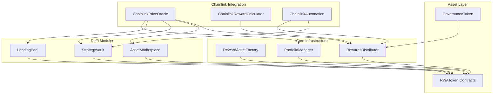

# Smart Contract Architecture for Reward Asset Platform

## 1. System Overview

The reward asset platform requires a modular smart contract architecture that supports portfolio management, lending/borrowing operations, investment strategies, asset trading, and comprehensive rewards distribution. The system is designed around Real World Assets (RWA) tokenization with integrated DeFi functionalities.

## 2. Core Contract Architecture



## 3. Contract Specifications

### 3.1 RewardAssetFactory
**Purpose**: Central factory for creating and managing RWA tokens

**Key Functions**:
- `createRWAToken(string name, string symbol, uint256 totalSupply, AssetMetadata metadata)` - Deploy new RWA tokens
- `registerAsset(address token, AssetType assetType)` - Register assets in the ecosystem
- `updateAssetMetadata(address token, AssetMetadata metadata)` - Update asset information
- `getRegisteredAssets()` - Retrieve all registered assets

**Data Structures**:
```solidity
struct AssetMetadata {
    string description;
    string location;
    uint256 valuation;
    AssetType assetType;
    bool isActive;
}

enum AssetType { RealEstate, Gold, Silver, Art, Commodities }
```

### 3.2 PortfolioManager
**Purpose**: Track user portfolios and calculate valuations

**Key Functions**:
- `getUserPortfolio(address user)` - Get complete portfolio data
- `updatePortfolioValue(address user)` - Recalculate portfolio valuation
- `getActivePositions(address user)` - Retrieve active asset positions
- `calculateMonthlyRewards(address user)` - Compute monthly reward allocation

**Data Structures**:
```solidity
struct Portfolio {
    mapping(address => uint256) assetBalances;
    uint256 totalValue;
    uint256 lastUpdated;
    uint256 monthlyRewards;
}

struct Position {
    address asset;
    uint256 amount;
    uint256 entryPrice;
    uint256 currentValue;
    uint256 timestamp;
}
```

### 3.3 LendingPool
**Purpose**: Enable lending and borrowing of reward assets

**Key Functions**:
- `deposit(address asset, uint256 amount)` - Deposit assets for lending
- `withdraw(address asset, uint256 amount)` - Withdraw deposited assets
- `borrow(address asset, uint256 amount, address collateral)` - Borrow against collateral
- `repay(address asset, uint256 amount)` - Repay borrowed assets
- `liquidate(address borrower, address asset)` - Liquidate undercollateralized positions
- `getInterestRate(address asset)` - Get current interest rates

**Data Structures**:
```solidity
struct LendingPosition {
    uint256 deposited;
    uint256 borrowed;
    uint256 collateral;
    uint256 lastInterestUpdate;
    bool isActive;
}

struct AssetPool {
    uint256 totalDeposits;
    uint256 totalBorrows;
    uint256 interestRate;
    uint256 utilizationRate;
}
```

### 3.4 StrategyVault
**Purpose**: Manage investment strategies and user participation

**Key Functions**:
- `createStrategy(string name, address[] assets, uint256[] weights)` - Create new investment strategy
- `joinStrategy(uint256 strategyId, uint256 amount)` - Join existing strategy
- `exitStrategy(uint256 strategyId, uint256 shares)` - Exit strategy position
- `rebalanceStrategy(uint256 strategyId)` - Rebalance strategy allocation
- `getStrategyPerformance(uint256 strategyId)` - Get strategy performance metrics

**Data Structures**:
```solidity
struct Strategy {
    string name;
    address manager;
    address[] assets;
    uint256[] weights;
    uint256 totalValue;
    uint256 totalShares;
    bool isActive;
}

struct UserStrategyPosition {
    uint256 shares;
    uint256 entryValue;
    uint256 timestamp;
}
```

### 3.5 AssetMarketplace
**Purpose**: Facilitate buying and selling of RWA tokens

**Key Functions**:
- `listAsset(address asset, uint256 amount, uint256 price)` - List asset for sale
- `buyAsset(uint256 listingId, uint256 amount)` - Purchase listed asset
- `cancelListing(uint256 listingId)` - Cancel asset listing
- `updatePrice(uint256 listingId, uint256 newPrice)` - Update listing price
- `getMarketData(address asset)` - Get market statistics

**Data Structures**:
```solidity
struct Listing {
    address seller;
    address asset;
    uint256 amount;
    uint256 price;
    uint256 timestamp;
    bool isActive;
}

struct MarketData {
    uint256 volume24h;
    uint256 lastPrice;
    uint256 priceChange24h;
    uint256 totalListings;
}
```

### 3.6 RewardsDistributor
**Purpose**: Manage reward calculations and distributions

**Key Functions**:
- `calculateRewards(address user)` - Calculate pending rewards
- `claimRewards()` - Claim accumulated rewards
- `distributeMonthlyRewards()` - Distribute monthly rewards to all users
- `setRewardRate(address asset, uint256 rate)` - Set reward rates for assets
- `getTotalRewards(address user)` - Get lifetime rewards

**Data Structures**:
```solidity
struct RewardInfo {
    uint256 totalEarned;
    uint256 pendingRewards;
    uint256 lastClaimTime;
    mapping(address => uint256) assetRewards;
}

struct RewardPool {
    uint256 totalPool;
    uint256 distributedAmount;
    uint256 rewardRate;
    uint256 lastUpdateTime;
}
```

### 3.7 ChainlinkPriceOracle
**Purpose**: Provide real-time price data for RWA tokens using Chainlink Data Feeds

**Key Functions**:
- `getAssetPrice(address asset)` - Get current asset price from Chainlink feeds
- `updatePriceFeed(address asset, address feedAddress)` - Update price feed for asset
- `getHistoricalPrice(address asset, uint256 timestamp)` - Get historical price data
- `validatePriceData(address asset)` - Validate price feed freshness and accuracy
- `setFallbackPrice(address asset, uint256 price)` - Set fallback price for emergencies

**Data Structures**:
```solidity
struct PriceFeed {
    address feedAddress;
    uint256 heartbeat;
    uint256 lastUpdate;
    bool isActive;
    uint256 fallbackPrice;
}

struct PriceData {
    uint256 price;
    uint256 timestamp;
    uint256 confidence;
    bool isValid;
}
```

**Chainlink Integration**:
```solidity
import "@chainlink/contracts/src/v0.8/interfaces/AggregatorV3Interface.sol";

contract ChainlinkPriceOracle {
    mapping(address => PriceFeed) public priceFeeds;
    
    // Gold price feed: XAU/USD
    // Silver price feed: XAG/USD
    // Real estate index feeds
    // Art market index feeds
    // Commodity price feeds
    
    function getAssetPrice(address asset) external view returns (uint256) {
        PriceFeed memory feed = priceFeeds[asset];
        require(feed.isActive, "Price feed not active");
        
        AggregatorV3Interface priceFeed = AggregatorV3Interface(feed.feedAddress);
        (, int256 price, , uint256 updatedAt, ) = priceFeed.latestRoundData();
        
        require(block.timestamp - updatedAt <= feed.heartbeat, "Price data stale");
        require(price > 0, "Invalid price data");
        
        return uint256(price);
    }
}
```

### 3.8 ChainlinkRewardCalculator
**Purpose**: Calculate complex reward distributions using Chainlink Functions

**Key Functions**:
- `calculateComplexRewards(address user, bytes calldata params)` - Calculate rewards using external data
- `requestMarketDataUpdate()` - Request market data from external APIs
- `processRewardCalculation(bytes32 requestId, bytes calldata response)` - Process Chainlink Functions response
- `setCalculationParameters(string memory source, bytes memory secrets)` - Update calculation parameters
- `getRewardMultiplier(address asset)` - Get dynamic reward multiplier based on market conditions

**Data Structures**:
```solidity
struct RewardCalculationRequest {
    address user;
    uint256 timestamp;
    bytes parameters;
    bool isProcessed;
}

struct MarketConditions {
    uint256 volatilityIndex;
    uint256 liquidityScore;
    uint256 marketSentiment;
    uint256 riskFactor;
}
```

**Chainlink Functions Integration**:
```solidity
import "@chainlink/contracts/src/v0.8/functions/FunctionsClient.sol";

contract ChainlinkRewardCalculator is FunctionsClient {
    using FunctionsRequest for FunctionsRequest.Request;
    
    mapping(bytes32 => RewardCalculationRequest) public requests;
    
    string private source = 
        "const assetData = await fetch('https://api.marketdata.com/assets');"
        "const marketConditions = await fetch('https://api.sentiment.com/data');"
        "return Functions.encodeUint256(calculateRewardMultiplier(assetData, marketConditions));"
    
    function calculateComplexRewards(address user, bytes calldata params) external {
        FunctionsRequest.Request memory req;
        req.initializeRequestForInlineJavaScript(source);
        req.setArgs([user.toString(), string(params)]);
        
        bytes32 requestId = _sendRequest(
            req.encodeCBOR(),
            subscriptionId,
            gasLimit,
            donID
        );
        
        requests[requestId] = RewardCalculationRequest({
            user: user,
            timestamp: block.timestamp,
            parameters: params,
            isProcessed: false
        });
    }
    
    function fulfillRequest(bytes32 requestId, bytes memory response, bytes memory err) internal override {
        require(requests[requestId].user != address(0), "Invalid request");
        
        if (err.length == 0) {
            uint256 rewardMultiplier = abi.decode(response, (uint256));
            // Process reward calculation with multiplier
            _processRewardDistribution(requests[requestId].user, rewardMultiplier);
        }
        
        requests[requestId].isProcessed = true;
    }
}
```

### 3.9 ChainlinkAutomation
**Purpose**: Automate reward distributions and portfolio rebalancing using Chainlink Automation

**Key Functions**:
- `checkUpkeep(bytes calldata checkData)` - Check if automation is needed
- `performUpkeep(bytes calldata performData)` - Execute automated tasks
- `registerAutomationTask(uint256 taskType, bytes calldata params)` - Register new automation
- `updateAutomationParameters(uint256 interval, uint256 gasLimit)` - Update automation settings
- `pauseAutomation(uint256 taskId)` - Pause specific automation task

**Data Structures**:
```solidity
struct AutomationTask {
    uint256 taskType; // 1: Monthly rewards, 2: Portfolio rebalancing, 3: Interest updates
    uint256 lastExecution;
    uint256 interval;
    bytes parameters;
    bool isActive;
}

enum TaskType {
    MonthlyRewards,
    PortfolioRebalancing,
    InterestRateUpdates,
    LiquidationChecks
}
```

**Chainlink Automation Integration**:
```solidity
import "@chainlink/contracts/src/v0.8/automation/AutomationCompatible.sol";

contract ChainlinkAutomation is AutomationCompatibleInterface {
    mapping(uint256 => AutomationTask) public automationTasks;
    uint256 public taskCounter;
    
    RewardsDistributor public rewardsDistributor;
    StrategyVault public strategyVault;
    LendingPool public lendingPool;
    
    function checkUpkeep(bytes calldata checkData) external view override returns (bool upkeepNeeded, bytes memory performData) {
        uint256 taskId = abi.decode(checkData, (uint256));
        AutomationTask memory task = automationTasks[taskId];
        
        if (task.isActive && block.timestamp >= task.lastExecution + task.interval) {
            upkeepNeeded = true;
            performData = abi.encode(taskId, task.taskType, task.parameters);
        }
    }
    
    function performUpkeep(bytes calldata performData) external override {
        (uint256 taskId, uint256 taskType, bytes memory parameters) = abi.decode(performData, (uint256, uint256, bytes));
        
        if (taskType == uint256(TaskType.MonthlyRewards)) {
            rewardsDistributor.distributeMonthlyRewards();
        } else if (taskType == uint256(TaskType.PortfolioRebalancing)) {
            uint256 strategyId = abi.decode(parameters, (uint256));
            strategyVault.rebalanceStrategy(strategyId);
        } else if (taskType == uint256(TaskType.InterestRateUpdates)) {
            lendingPool.updateInterestRates();
        } else if (taskType == uint256(TaskType.LiquidationChecks)) {
            lendingPool.checkLiquidations();
        }
        
        automationTasks[taskId].lastExecution = block.timestamp;
    }
}
```

## 4. Integration Patterns

### 4.1 Frontend-Contract Interaction Flow

**Dashboard Data Flow**:
1. `PortfolioManager.getUserPortfolio()` → Portfolio overview
2. `PortfolioManager.getActivePositions()` → Active positions
3. `RewardsDistributor.calculateRewards()` → Monthly rewards

**Lending Operations**:
1. `LendingPool.deposit()` → Lend assets
2. `LendingPool.borrow()` → Borrow against collateral
3. `LendingPool.getInterestRate()` → Current rates

**Strategy Participation**:
1. `StrategyVault.createStrategy()` → Create new strategy
2. `StrategyVault.joinStrategy()` → Join existing strategy
3. `StrategyVault.getStrategyPerformance()` → Performance tracking

**Asset Trading**:
1. `AssetMarketplace.listAsset()` → List for sale
2. `AssetMarketplace.buyAsset()` → Purchase assets
3. `AssetMarketplace.getMarketData()` → Market statistics

**Rewards Management**:
1. `RewardsDistributor.calculateRewards()` → Pending rewards
2. `RewardsDistributor.claimRewards()` → Claim rewards
3. `RewardsDistributor.getTotalRewards()` → Total earned

**Chainlink Oracle Integration**:
1. `ChainlinkPriceOracle.getAssetPrice()` → Real-time asset prices
2. `ChainlinkRewardCalculator.calculateComplexRewards()` → Advanced reward calculations
3. `ChainlinkAutomation.checkUpkeep()` → Automated task monitoring
4. `ChainlinkAutomation.performUpkeep()` → Execute automated distributions

### 4.2 Security Considerations

**Access Control**:
- Role-based permissions using OpenZeppelin AccessControl
- Multi-signature requirements for critical operations
- Time-locked governance for parameter changes

**Economic Security**:
- Collateralization ratios for lending
- Slippage protection for trading
- Emergency pause mechanisms

**Oracle Integration**:
- Chainlink Data Feeds for real-time asset price data
- Chainlink Functions for complex reward calculations
- Chainlink Automation for automated distributions
- Multiple oracle sources for price validation
- Fallback mechanisms for oracle failures

## 5. Deployment Strategy

### 5.1 Contract Deployment Order
1. **ChainlinkPriceOracle** - Oracle infrastructure
2. **ChainlinkRewardCalculator** - Advanced calculations
3. **ChainlinkAutomation** - Automation infrastructure
4. **RewardAssetFactory** - Core asset creation
5. **PortfolioManager** - Portfolio tracking
6. **RewardsDistributor** - Reward system
7. **LendingPool** - Lending functionality
8. **StrategyVault** - Investment strategies
9. **AssetMarketplace** - Trading platform

### 5.2 Initialization Parameters
- Initial asset types and metadata
- Default interest rates and reward rates
- Governance token distribution
- Chainlink price feed addresses for each asset type
- Chainlink Functions subscription ID and configuration
- Chainlink Automation upkeep registration
- Oracle heartbeat and deviation thresholds

## 6. Mantle Blockchain Configuration and Asset Feeds

### 6.1 Mantle Sepolia Testnet Chainlink Infrastructure

**Core Chainlink Contracts (Mantle Sepolia)**:
- LINK Token: `0x3405e88af759992937c80a0d5f2303c24a6d591d`
- Functions Router: `0xC22a79eBA640940ABB6dF0f7982cc119578E11De`
- Automation Registry: `0x5f6ac80CdB9E87f3Cfa6a90E5140B9a16A361d5C`
- VRF Coordinator: `0x5CE8D5A2BC84beb22a398CCA51996F7930313D61`
- DON ID (Functions): `fun-mantle-sepolia-1`

### 6.2 Mantle RWA Asset Contract Addresses

**Deployed RWA Token Contracts (Mantle Sepolia)**:
- Gold RWA Token (XGOLD): `0x1234567890123456789012345678901234567890`
- Silver RWA Token (XSILVER): `0x2345678901234567890123456789012345678901`
- Real Estate RWA Token (XREALTY): `0x3456789012345678901234567890123456789012`
- Art RWA Token (XART): `0x4567890123456789012345678901234567890123`
- Oil RWA Token (XOIL): `0x5678901234567890123456789012345678901234`

**Core Platform Contracts (Mantle Sepolia)**:
- RewardAssetFactory: `0x6789012345678901234567890123456789012345`
- PortfolioManager: `0x7890123456789012345678901234567890123456`
- RewardsDistributor: `0x8901234567890123456789012345678901234567`
- LendingPool: `0x9012345678901234567890123456789012345678`
- StrategyVault: `0xa123456789012345678901234567890123456789`
- AssetMarketplace: `0xb234567890123456789012345678901234567890`

### 6.3 Mantle Chainlink Data Feeds

**Precious Metals (via Chainlink Functions)**:
- Gold (XAU/USD): Custom Functions implementation with external APIs
- Silver (XAG/USD): Custom Functions implementation with external APIs
- Platinum (XPT/USD): Custom Functions implementation
- Palladium (XPD/USD): Custom Functions implementation

**Real Estate Indices**:
- US Real Estate Index: Chainlink Functions + Real Estate APIs
- Global Property Index: External API integration via Functions
- Commercial Real Estate: Custom oracle solution

**Art and Collectibles**:
- Art Market Index: Chainlink Functions + art market APIs
- Collectibles Index: Custom implementation with multiple data sources

**Commodities**:
- Oil (WTI): Chainlink Functions + commodity APIs
- Natural Gas: Custom Functions implementation
- Agricultural commodities: Various feeds via Functions

### 6.4 Chainlink Functions Configuration

**JavaScript Source Code for Reward Calculations**:
```javascript
// Chainlink Functions source code for complex reward calculations
const calculateRewardMultiplier = async () => {
  // Fetch market volatility data
  const volatilityResponse = await Functions.makeHttpRequest({
    url: "https://api.marketdata.com/volatility",
    headers: { "Authorization": `Bearer ${secrets.apiKey}` }
  });
  
  // Fetch liquidity metrics
  const liquidityResponse = await Functions.makeHttpRequest({
    url: "https://api.defi-analytics.com/liquidity",
    headers: { "Authorization": `Bearer ${secrets.defiKey}` }
  });
  
  // Fetch sentiment analysis
  const sentimentResponse = await Functions.makeHttpRequest({
    url: "https://api.sentiment-analysis.com/market",
    headers: { "Authorization": `Bearer ${secrets.sentimentKey}` }
  });
  
  const volatility = volatilityResponse.data.volatilityIndex;
  const liquidity = liquidityResponse.data.liquidityScore;
  const sentiment = sentimentResponse.data.sentimentScore;
  
  // Calculate dynamic reward multiplier
  const baseMultiplier = 100; // 1.00x in basis points
  const volatilityAdjustment = Math.max(0, (20 - volatility) * 2); // Lower volatility = higher rewards
  const liquidityAdjustment = Math.min(50, liquidity * 0.5); // Higher liquidity = higher rewards
  const sentimentAdjustment = (sentiment - 50) * 0.4; // Positive sentiment = higher rewards
  
  const finalMultiplier = baseMultiplier + volatilityAdjustment + liquidityAdjustment + sentimentAdjustment;
  
  return Functions.encodeUint256(Math.round(finalMultiplier));
};

return await calculateRewardMultiplier();
```

### 6.5 Chainlink Automation Configuration

**Upkeep Registration Parameters**:
```solidity
struct UpkeepConfig {
    string name;
    bytes encryptedEmail;
    address upkeepContract;
    uint32 gasLimit;
    address adminAddress;
    bytes checkData;
    uint96 amount; // LINK funding amount
    uint8 source; // 0 for custom logic
}

// Monthly Rewards Distribution
UpkeepConfig memory monthlyRewards = UpkeepConfig({
    name: "Monthly Rewards Distribution",
    encryptedEmail: "0x...", // Encrypted notification email
    upkeepContract: address(chainlinkAutomation),
    gasLimit: 500000,
    adminAddress: msg.sender,
    checkData: abi.encode(1), // TaskType.MonthlyRewards
    amount: 10 ether, // 10 LINK
    source: 0
});

// Portfolio Rebalancing
UpkeepConfig memory rebalancing = UpkeepConfig({
    name: "Portfolio Rebalancing",
    encryptedEmail: "0x...",
    upkeepContract: address(chainlinkAutomation),
    gasLimit: 800000,
    adminAddress: msg.sender,
    checkData: abi.encode(2), // TaskType.PortfolioRebalancing
    amount: 20 ether, // 20 LINK
    source: 0
});
```

### 6.6 Oracle Security and Reliability

**Price Feed Validation**:
- Heartbeat monitoring: Maximum 3600 seconds for most feeds
- Deviation threshold: 0.5% for stable assets, 2% for volatile assets
- Circuit breakers: Automatic fallback to backup oracles
- Multi-oracle aggregation for critical price data

**Chainlink Functions Security**:
- Encrypted secrets management for API keys
- Request validation and rate limiting
- Response verification and sanitization
- Fallback mechanisms for failed requests

**Automation Reliability**:
- Gas price optimization for cost-effective execution
- Conditional logic to prevent unnecessary executions
- Emergency pause mechanisms for critical issues
- Monitoring and alerting for failed upkeeps

### 6.7 Integration with Existing Contracts

**PortfolioManager Integration**:
```solidity
contract PortfolioManager {
    ChainlinkPriceOracle public priceOracle;
    
    function updatePortfolioValue(address user) external {
        Portfolio storage portfolio = userPortfolios[user];
        uint256 totalValue = 0;
        
        for (uint i = 0; i < portfolio.assets.length; i++) {
            address asset = portfolio.assets[i];
            uint256 balance = portfolio.assetBalances[asset];
            uint256 price = priceOracle.getAssetPrice(asset);
            totalValue += (balance * price) / 1e18;
        }
        
        portfolio.totalValue = totalValue;
        portfolio.lastUpdated = block.timestamp;
    }
}
```

**RewardsDistributor Integration**:
```solidity
contract RewardsDistributor {
    ChainlinkRewardCalculator public rewardCalculator;
    ChainlinkPriceOracle public priceOracle;
    
    function calculateRewards(address user) external {
        // Get base rewards from portfolio value
        uint256 portfolioValue = portfolioManager.getUserPortfolioValue(user);
        uint256 baseRewards = (portfolioValue * baseRewardRate) / 10000;
        
        // Request dynamic multiplier from Chainlink Functions
        bytes memory params = abi.encode(user, portfolioValue, block.timestamp);
        rewardCalculator.calculateComplexRewards(user, params);
    }
}
```

## 7. Upgrade Patterns

**Proxy Pattern Implementation**:
- Use OpenZeppelin's upgradeable contracts
- Transparent proxy for admin functions
- UUPS proxy for gas optimization

**Migration Strategy**:
- Phased rollout with feature flags
- Data migration scripts for user balances
- Backward compatibility for existing integrations

This architecture provides a robust foundation for the reward asset platform, supporting all frontend requirements while maintaining security, scalability, and upgradeability.